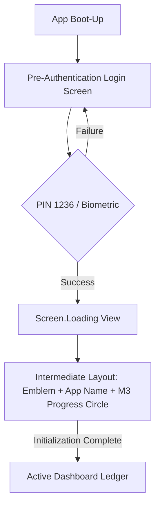
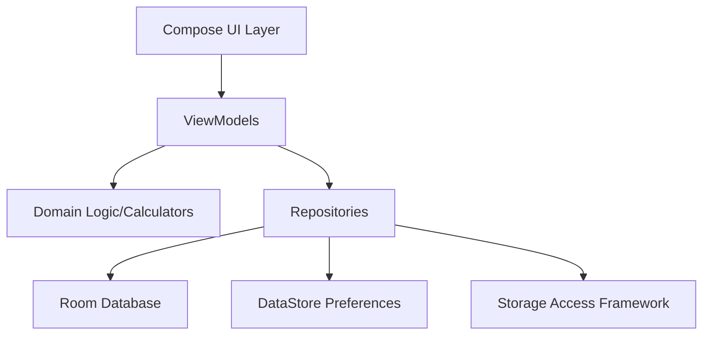

# Financial Matrix Ledger: System Architecture Blueprint

This document serves as the absolute source of truth for the **Financial Matrix Ledger** project. It defines the structural patterns, layer boundaries, and non-negotiable quality standards governing the application's development.

---

## Section 1: Architectural Patterns & Layer Boundaries

The project adheres to **Clean Architecture** principles combined with the **MVVM (Model-View-ViewModel)** pattern, ensuring a clear separation of concerns and high testability.

### 1.1 Layer Definitions
| Layer | Components | Responsibilities |
| :--- | :--- | :--- |
| **Presentation** | Jetpack Compose, ViewModels, UI State | Rendering the UI, handling user interactions, and exposing reactive state streams. |
| **Domain** | Sealed Models, Math Engines, Use Cases | Pure business logic, type-safe category definitions, and complex financial calculations. |
| **Data** | Room DB, DAOs, DataStore, SAF | Persistence, local storage management, and raw system stream handling for exports. |

### 1.2 Data Flow Topography
Data flows reactively from the local Room database to the UI using Kotlin `StateFlow`.
- **Database (Room):** Emits cold `Flow` streams from DAOs.
- **Repository:** Wraps DAOs and provides a clean API to the Domain/Presentation layers.
- **ViewModel:** Consumes multiple repository flows, using `combine` to merge data into a single `TransactionUiState`.
- **UI (Compose):** Collects the `StateFlow` via `collectAsStateWithLifecycle()` to trigger recompositions.

### 1.3 Threading & Concurrency
- **Dispatchers.IO:** Mandatory for all database transactions and File I/O (Exporting).
- **Dispatchers.Default:** Reserved for heavy arithmetic, filtering, and sorting within the ViewModels to keep the Main thread responsive.
- **Main Thread:** Restricted to UI rendering and event handling only.

### 1.4 Navigation Scaffolding
- **Right-Side Navigation:** The `ModalNavigationDrawer` is anchored to and slides exclusively from the **Right edge** of the display.
- **Ergonomic Alignment:** This anchors the dashboard hub to the top-right 3-bar menu action icon, ensuring a consistent ergonomic interaction model.

---

## Section 2: Complete Package Matrix & Class Index

### 2.1 Domain Layer (`com.karlvcrisostomo.financialmatrix.domain`)
- **`TransactionCategory` (Sealed):** Type-safe structures (Food, Utilities, etc.) with internal transfer identification logic (`.isInternalTransfer()`) for KPI exclusion.
- **`StatementCycleCalculator`:** Manages billing window logic. Uses `TemporalAdjusters.lastDayOfMonth()` for defensive month-ceiling bounding, ensuring accurate statement windows for short months (e.g., February).

### 2.2 Data Layer (`com.karlvcrisostomo.financialmatrix.core`, `features.*.data`)
- **`AppDatabase`:** Central Room instance managing Transactions, Income, and Credit Card entities.
- **`UserPreferencesRepository`:** Manages app-wide settings (Currency, Budget Limits) via Jetpack DataStore.
- **`ExportUtils`:** Manages Storage Access Framework (SAF) CSV output streams. Handles transactional array serialization to comma-separated format for file persistence.

### 2.3 Presentation Layer (`features.*.ui`)
- **`TransactionViewModel`:** The primary reactive engine (conceptually `FinancialMatrixViewModel`). Applies `.isInternalTransfer()` filters and offloads analytics to `Dispatchers.Default`.
- **`TransactionScreen.kt`:** The main navigation host and global scaffold.
- **`CreditCardScreen.kt`:** High-volume vertical layout using `LazyColumn`. **Rule:** All card creation is routed through the main FAB; inline "+" header icons are prohibited.
- **`IncomeScreen.kt`:** Dashboard for tracking monthly earnings and savings KPIs.

---

## Section 3: Cross-Cutting Architectural Rules & Enforcements

### 3.1 Authentication Lifecycle
Entry is strictly blocked until security clearance is obtained via the following sequential gate:



- **Login Screen UI:** Solid `#0B1A30` Midnight Navy background with Premium Gold typography.

### 3.2 Non-Negotiable Quality Gates
1. **100% Code Coverage Guardrail:** Asynchronous flows in ViewModels must be tested via `Turbine`. Calculations require exhaustive unit coverage.
2. **Zero-Warning Compilation Policy:** No lint warnings, layout errors, or deprecated `@Composable` usage.
3. **Local Certification Suite:** Developers must achieve a green status via the automation tool before any Git commit:
   ```powershell
   ./certify_build.ps1
   ```

---

## Visual Project Blueprint (High-Level)

