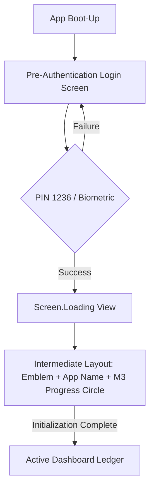
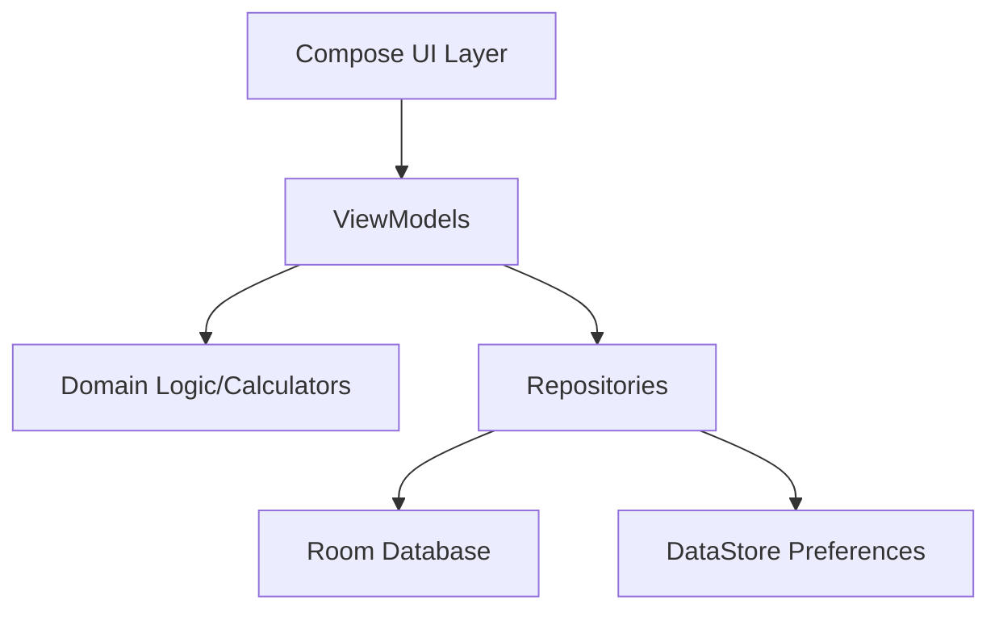

# Financial Matrix Ledger: System Architecture Blueprint

This document serves as the absolute source of truth for the **Financial Matrix Ledger** project. It defines the structural patterns, layer boundaries, and non-negotiable quality standards governing the application's development.

---

## Section 1: Architectural Patterns & Layer Boundaries

The project adheres to **Clean Architecture** principles combined with the **MVVM (Model-View-ViewModel)** pattern, ensuring a clear separation of concerns and high testability.

### 1.1 Layer Definitions
| Layer | Components | Responsibilities |
| :--- | :--- | :--- |
| **Presentation** | Jetpack Compose, ViewModels, UI State | Rendering the UI, handling user interactions, and exposing reactive state streams. |
| **Domain** | Sealed Models, Math Engines, Use Cases | Pure business logic, type-safe category definitions, and complex financial calculations. **Mandatory:** Isolate validation logic (e.g., `ValidateTransactionSourceUseCase`) to prevent circular debt or invalid funding sources. |
| **Data** | Room DB, DAOs, DataStore | Persistence and local storage management. |

### 1.2 Data Flow Topography
Data flows reactively from the local Room database to the UI using Kotlin `StateFlow`.
- **Database (Room):** Emits cold `Flow` streams from DAOs.
   * **Atomic Ledger Rule:** All multi-entity updates (e.g., inserting a transaction while updating a Credit Card balance) MUST be wrapped in a Room `@Transaction` block to ensure atomicity. If any part fails, the entire ledger adjustment must roll back.
   * **Schema Versioning & Migration Rule:** Any modification to the database structural design (adding tables, altering columns, changing indices) MUST increment the database version and be paired with an explicit, hand-crafted Room `Migration` implementation.
   * **Destructive Fallback Prohibition:** The use of `fallbackToDestructiveMigration()` is strictly prohibited across all tracking branches. Every schema shift must safely transform existing user records without data truncation or ledger zeroing.
   * **Aggregation Efficiency Rule:** Large dataset aggregations (Weekly, Monthly, Yearly) MUST be handled via optimized SQLite/Room queries (e.g., using `strftime` for date grouping) rather than in-memory Kotlin collections to optimize memory footprint and prevent UI jank.
- **Repository:** Wraps DAOs and provides a clean API to the Domain/Presentation layers.
- **ViewModel:** Consumes multiple repository flows, using combine to merge data into layout-specific states (e.g., TransactionUiState solely for row processing, and an isolated state stream for the `SavingsDashboard.kt` component within the income ledger context).
- **UI (Compose):** Collects the `StateFlow` via `collectAsStateWithLifecycle()` to trigger recompositions.

### 1.3 Threading & Concurrency
- **Dispatchers.IO:** Mandatory for all database transactions.
- **Dispatchers.Default:** Reserved for heavy arithmetic (using `BigDecimal`), filtering, and sorting within the ViewModels to keep the Main thread responsive.
- **Main Thread:** Restricted to UI rendering and event handling only.
- **Financial Precision:** Prohibit the use of `Float` or `Double` for financial calculations. All currency values MUST be handled via `java.math.BigDecimal` to ensure absolute precision, mapped via Room `TypeConverters`. This applies strictly to all aggregation logic and chart data point calculations.

### 1.4 Navigation Scaffolding
- **Right-Side Navigation:** The `ModalNavigationDrawer` is anchored to and slides exclusively from the **Right edge** of the display.
- **Ergonomic Alignment:** This anchors the dashboard hub to the top-right 3-bar menu action icon, ensuring a consistent ergonomic interaction model.

---

## Section 2: Complete Package Matrix & Class Index

### 2.1 Domain Layer (`com.karlvcrisostomo.financialmatrix.domain`)
- **`TransactionCategory.kt` (Sealed):** Type-safe structures (Food, Utilities, etc.) with internal transfer identification logic (`.isInternalTransfer()`) for KPI exclusion.
- **`StatementCycleCalculator.kt`:** Manages billing window logic using dynamic, relative billing-cycle offsets. Applies .plusDays(daysAfterBillingDate) to the designated statement date to automatically calculate rolling payment timelines across varying month lengths (28, 29, 30, or 31 days).

### 2.2 Data Layer (`com.karlvcrisostomo.financialmatrix.core`, `features.*.data`)
- **`AppDatabase.kt`:** Central Room instance managing Transactions, Income, and Credit Card entities.
- **`UserPreferencesRepository.kt`:** Manages app-wide settings (Currency, Budget Limits) via Jetpack DataStore.

### 2.3 Presentation Layer (`features.*.ui`)
- **`TransactionViewModel.kt`:** The primary reactive engine governing transactional states and UI state mapping. Applies `.isInternalTransfer()` filters and offloads analytics to `Dispatchers.Default`.
- **`TransactionScreen.kt`:** The main navigation host and global scaffold. Dedicates 100% of its vertical layout strictly to expense row processing (`SavingsDashboard.kt` is completely un-embedded).
- **`CreditCardScreen.kt`:** High-volume vertical layout using `LazyColumn`. **Rule:** All card creation is routed through the main FAB; inline "+" header icons are prohibited.
- **`IncomeScreen.kt`:** Dashboard for tracking monthly earnings. Features the structural `SavingsDashboard.kt` component permanently mounted in the top header area.
- **`AboutScreen.kt`:** Provides the static informational route (`/about`). Displays application metadata, dynamic versioning via `BuildConfig.VERSION_NAME`, and handles navigation to the legal sub-route. Must utilize the standard application scaffold (Midnight Navy background) and rely entirely on localized strings. No business logic or state mutation is permitted.
- **`OssLicensesScreen.kt`:** Automatically parses and renders Open Source Software (OSS) licenses using the native `aboutlibraries-compose-m3` dependency. This ensures a 100% Jetpack Compose and Material 3 architecture, completely prohibiting the use of legacy Android Activity hooks for compliance rendering.

---

## Section 3: Cross-Cutting Architectural Rules & Enforcements

### 3.1 Authentication Lifecycle
Entry is strictly blocked until security clearance is obtained via the following sequential gate:



- **Login Screen UI:** Solid `#0B1A30` Midnight Navy background with Premium Gold typography.

### 3.2 Non-Negotiable Quality Gates
1. **100% Code Coverage Guardrail:** Asynchronous flows in ViewModels must be tested via `Turbine`. This specifically includes verifying multi-emission flow states during reactive ledger updates. Calculations require exhaustive unit coverage.
2. **Zero-Warning Compilation Policy:** No lint warnings, layout errors, or deprecated `@Composable` usage.
3. **Local Certification Suite:** Developers must achieve a green status via the automation tool before any Git commit. This suite includes Turbine flow validation and math engine precision checks:
   ```powershell
   ./certify_build.ps1
   ```

### 3.3 Transaction History & Analytics Release Roadmap
To ensure structural stability, the analytics feature is deployed in a phased approach:

#### Phase 1: Core Visualization & Precision Aggregation
- **Charting Engine:** Integration of the **Vico** library for native Compose rendering.
- **Precision Data Flow:** All analytics-related data MUST be aggregated at the SQLite level using `strftime` and `GROUP BY` to minimize memory overhead. 
- **Type Safety:** Absolute enforcement of `BigDecimal` for all chart data points and calculations.

#### Phase 2: Background Synchronization & Resilience
- **WorkManager Integration:** Offloading heavy reconciliation and data syncing to `AndroidX WorkManager`.
- **Sync Policies:** Periodic tasks must utilize `UNMETERED` network constraints and `EXPONENTIAL` backoff.
- **Retry Capping:** Workers must manually monitor `runAttemptCount` and fail after 5 attempts to prevent battery drain.

### 3.4 Charting & Visualization Guidelines (Phase 1)
The application utilizes the **Vico** library for native Jetpack Compose charting.
- **State Management:** Always utilize `CartesianChartModelProducer` within the ViewModel to maintain chart state across recompositions.
- **Asynchronous Updates:** Data updates to the chart model MUST be performed via `runTransaction` to offload processing from the Main thread.
- **Dynamic Styling:** Implement custom `ColumnProvider` or `LineProvider` for value-based color coding (e.g., distinguishing expense peaks or category segments).
- **Stability:** Ensure data models passed to Vico are marked as `@Stable` or `@Immutable`.

### 3.5 Background Synchronization Strategy (Phase 2)
Background tasks, such as data reconciliation or recurring transaction processing, are managed via **AndroidX WorkManager**.
- **Unique Work Enforcement:** Utilize `enqueueUniquePeriodicWork` with `ExistingPeriodicWorkPolicy.KEEP` to prevent redundant task scheduling.
- **Constraint Optimization:** Heavy sync operations MUST be restricted to `NetworkType.UNMETERED` and `setRequiresCharging(true)` to preserve battery and user data.
- **Resilience Policy:** Use `BackoffPolicy.EXPONENTIAL` for retries. Workers MUST manually monitor `runAttemptCount` and return `Result.failure()` after a maximum of 5 failed attempts to prevent infinite battery drain.

---

## Visual Project Blueprint (High-Level)

